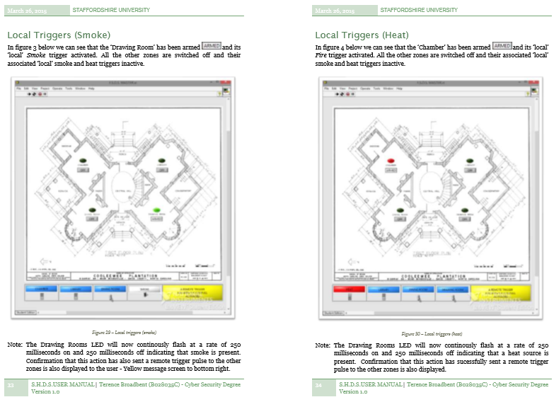
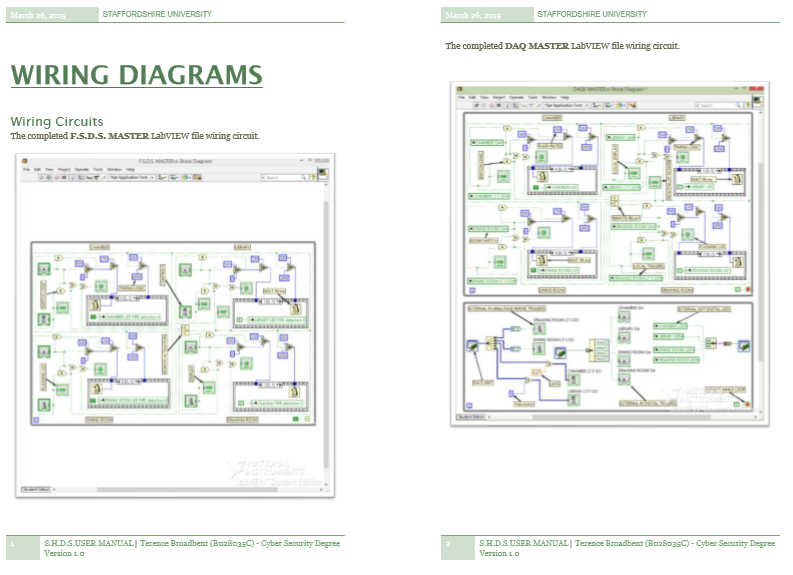

# FIRE ALARM SYSTEM
## USE OF LABVIEW 2013 TO CONSTRUCT A SOPHISTICATED SMOKE AND HEAT DETECTION SYSTEM.

| LANGUAGE | FILENAME           | MD5 Hash                         |
|------    |------              | -------                          |
| LabVIEW  | F.S.D.S. MASTER.vi | cb178626f925f14188cc6e89048ddc78 |
| LabVIEW  | DACS MASTER.vi     | 77d0fc4309002ed6d9c798147d318764 |
| PDF      | User Manual.pdf    | 01efa7e8ba027fd65462b9e4fd6d4fcd |
| PDF      | Sensor Report.pdf  | 6feb3d7055e470826221eddd958aefde |
| PDF      | Wiring Diagrams.pdf| 9ebb362c1c6ecfcfa177c615ef85494c |

- [x] The program and user manual have been specifically designed and written for LabVIEW - version 2013.

### SMOKE AND HEAT DETECTION SYSTEM

